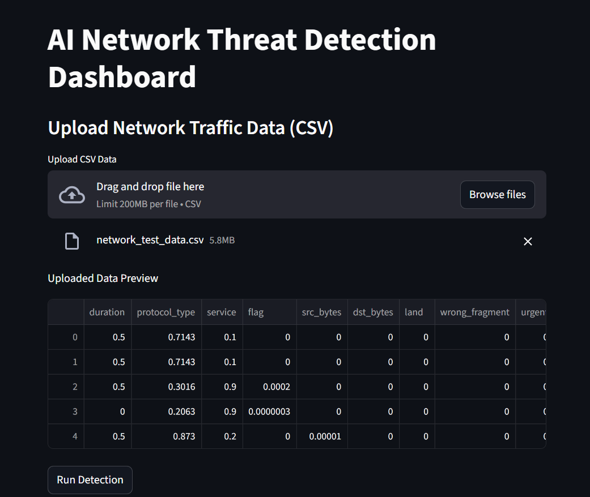
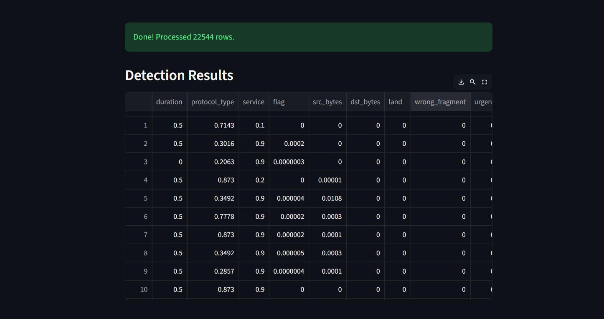
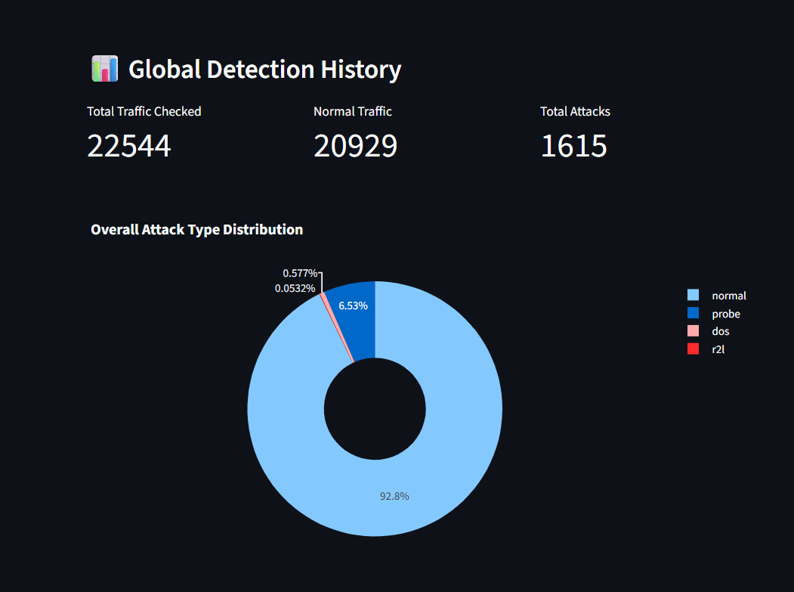
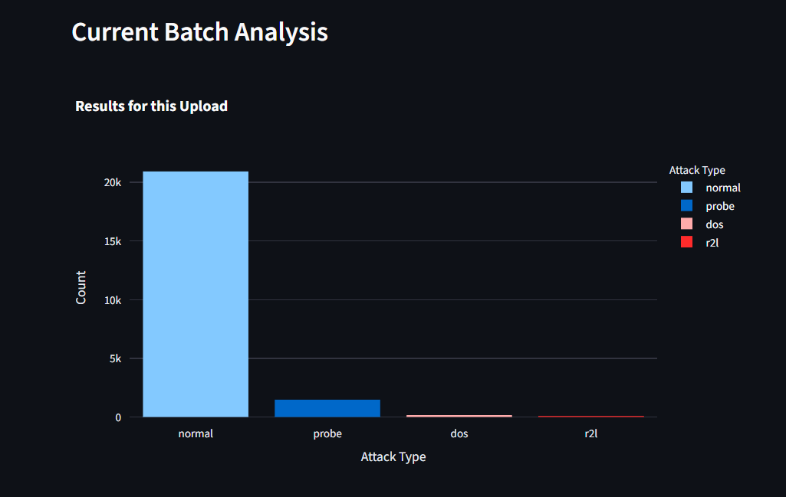

# 🔐 AI Network Threat Detection Dashboard

## 🚀 Project Overview
An end-to-end Machine Learning solution for real-time network intrusion detection.

### 📸 Dashboard Screenshots

#### 1. Upload & Detection

#### 2. Detection Results Table

#### 3. Overall Composition (Pie Chart)

#### 4. Threat History (Histogram)

---

## ⚙️ Installation & Setup

### 1. Set up Virtual Environment
`python -m venv venv`

### 2. Install Dependencies
`pip install -r requirements.txt`

### 3. Run the AI Engine
`uvicorn api.app:app --reload`

### 4. Run the Dashboard
`streamlit run dashboard.py`